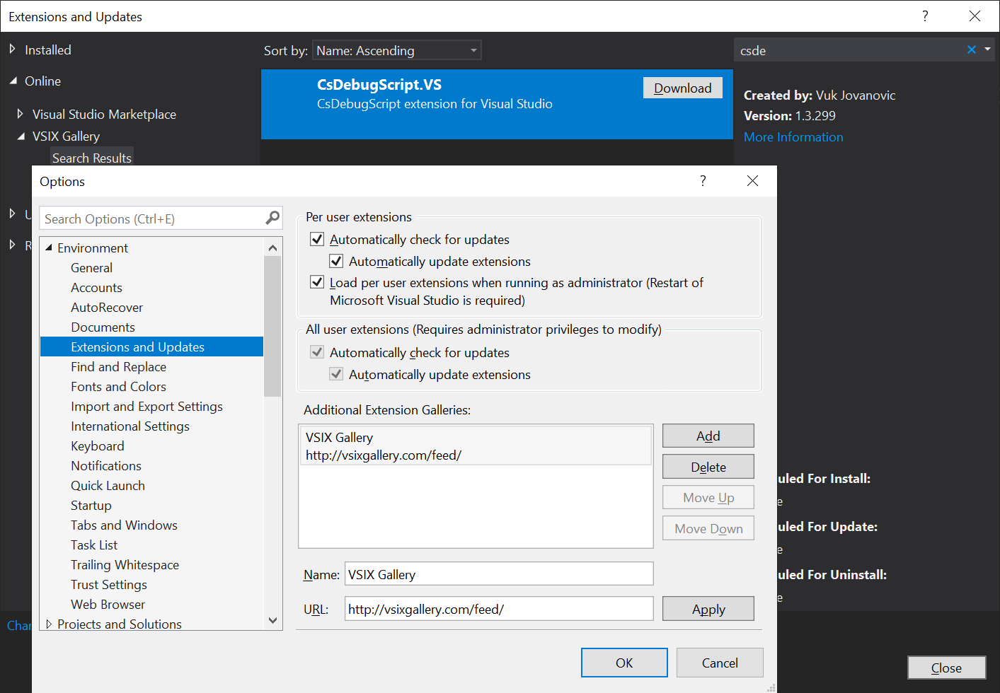
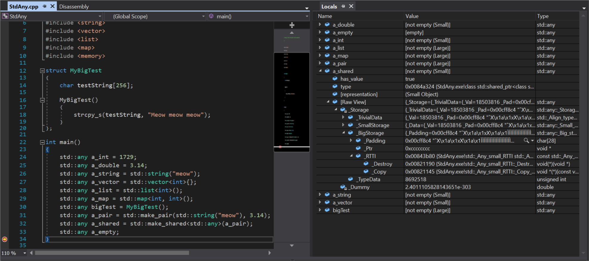
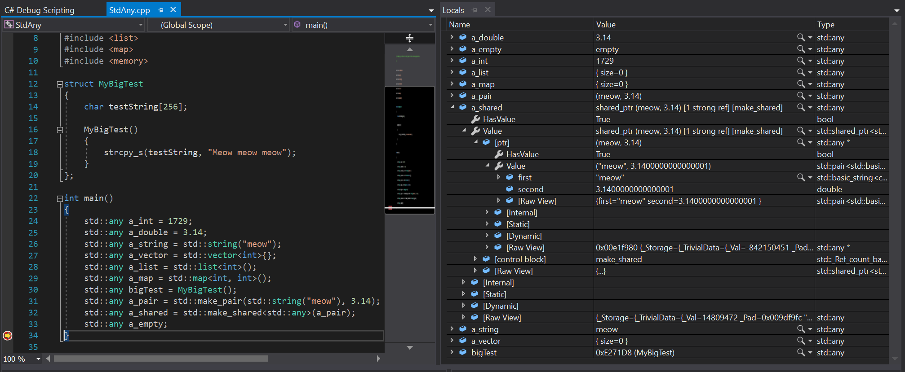
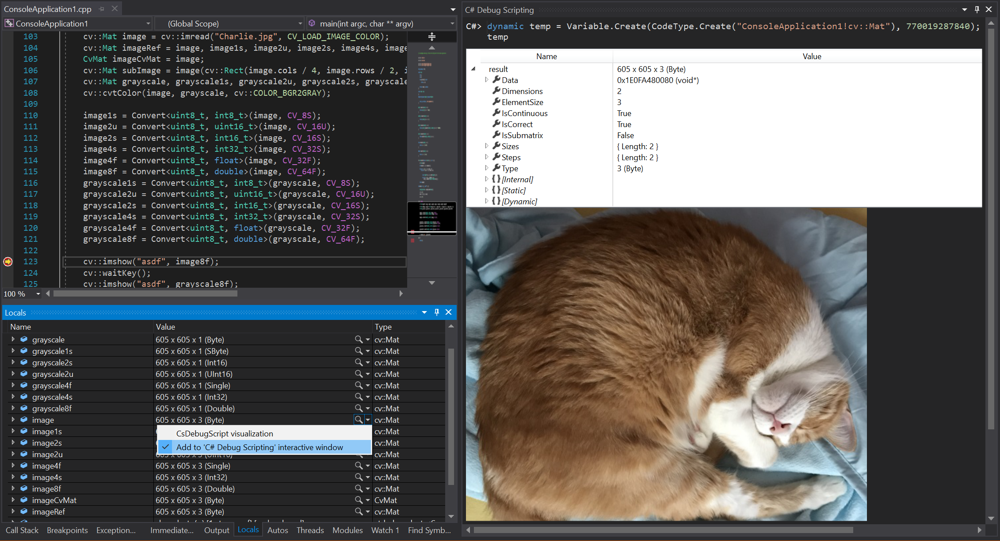
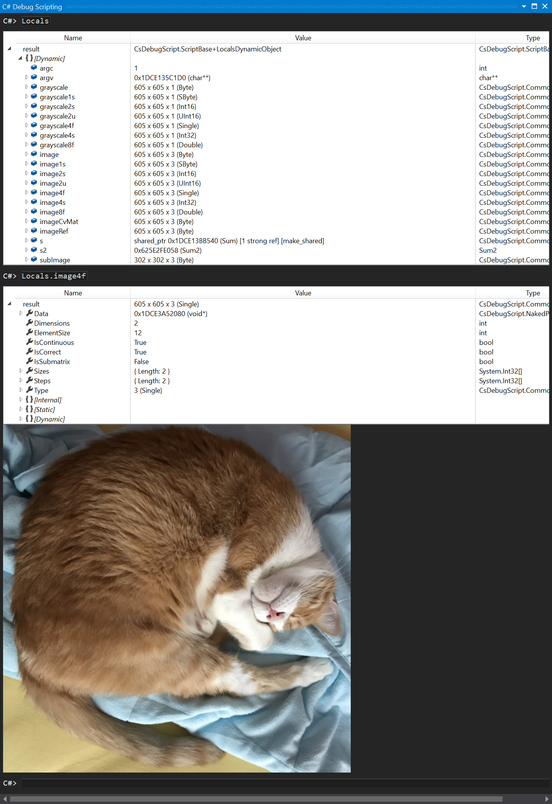

## Installing Visual Studio extension

### Open [VSIX Gallery](http://vsixgallery.com)
VSIX gallery will provide access to newest versions of extensions.

Open __Options/Environment/Extensions and Updates__. Add additional gallery: http://vsixgallery.com/feed/

Open __Extensions and Updates__ and in new gallery search for CsDebugScript.VS extension.


## Automatic visualizations

### std::any
Without extension:

With extension installed:


### cv::Mat (OpenCV images)


## User defined visualizations
In order to define new visualizations, you need to do following:
1. Define initialization script that will define/reference user type
2. Define NatVis file that will contain all the types that should be visualized

### Initialization script
By default, engine will load initialization script relative to the default project location: `CsDebugScript/init.csx'.

You can see more about how to define [user types](UserTypes.md).

Learn more about how to reference user types in [tutorials](Tutorials.md).

### User type definition in NatVis
Here is an example NatVis file:
```xml
<?xml version="1.0" encoding="utf-8"?>
<AutoVisualizer xmlns="http://schemas.microsoft.com/vstudio/debugger/natvis/2010">
    <Type Name="MyUserType">
        <CustomVisualizer VisualizerId="{401DAED1-A74F-49F3-9B03-66786EBF65B6}"/>
    </Type>
</AutoVisualizer>
```

## Interactive mode
Learn more about easier scripting in [interactive mode](InteractiveMode.md).

Open interactive mode window by clicking: View / Other Windows / C# DebugSript interactive window.

Note that interactive mode is active only while in debugger break mode.

### Executing scripts
Use `#load` command to execute scripts:
```cs
#load "script_path.csx"
```

### Clearing interactive window
Use `#clear` command to clear interactive window.

### Reseting interactive mode
`#reset` command will clear all stored variables and loaded scripts, start over and reload initialization script.
