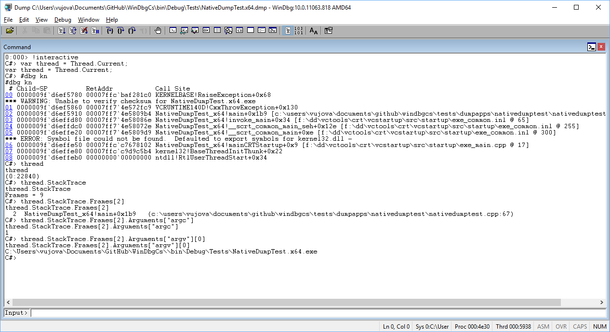
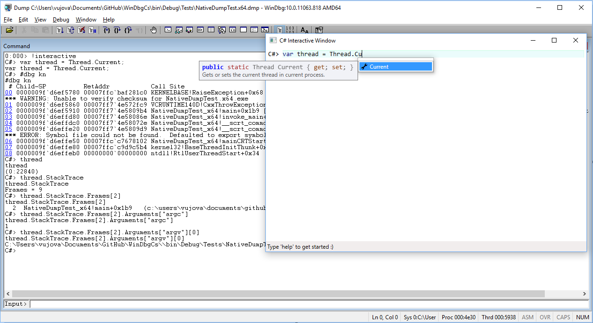
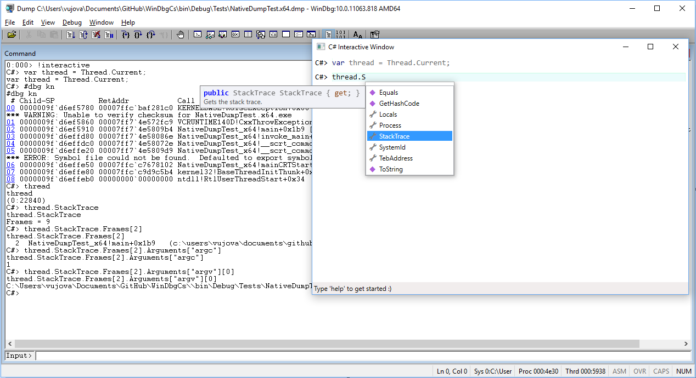

## Using WinDbg extension
1. Download extension from [latest GitHub release](https://github.com/southpolenator/WinDbgCs/releases/latest) or from [Latest build](https://ci.appveyor.com/project/southpolenator/windbgcs/branch/next).
2. Extract it to some folder (don't forget to "Unblock" zip file before extraction)
3. Load it into WinDbg session using [.load](https://msdn.microsoft.com/en-us/library/windows/hardware/ff563964%28v=vs.85%29.aspx) commnd. For example:
```
.load C:\debuggers\winext\CsDebugScript.WinDbg.x64.dll
```

## Executing C# scripts
Use `!execute` command exported from CsDebugScript.WinDbg extension:
```
!execute path_to_csx_script [optional arguments given to the script]
```
For example:
```
!execute C:\Scripts\myscript.csx
```
In case you have one more extension that exports !execute command, you must specify extension at the beginning:
```
!CsDebugScript.execute c:\Scripts\myscript.csx
```
Learn more about writting scripts in [Tutorials](Tutorials.md).

## Entering interactive mode
Use `!interactive` command exported from CsDebugScript extension:
```
!CsDebugScript.interactive
```
Interactive mode can execute both WinDbg commands and C# expressions. C# expression saves the state and must end with semicolon (;). WinDbg commands start with #dbg. For example you can enter following commands and not get an error:

```
var a = Threads[0];
#dbg kn
writeln("{0}:{1}", a.Id, a.SystemId);
```
Learn more about easier scripting in [interactive mode](InteractiveMode.md).

### Screenshots


## Entering UI interactive mode
Use `!openui` command exported from CsDebugScript extension:
```
!CsDebugScript.openui
```
UI interactive mode is more powerful than regular interactive mode as it provides C# editor, completion window, XML documentation, etc.

Learn more about easier scripting in [interactive mode](InteractiveMode.md).

### Screenshots



